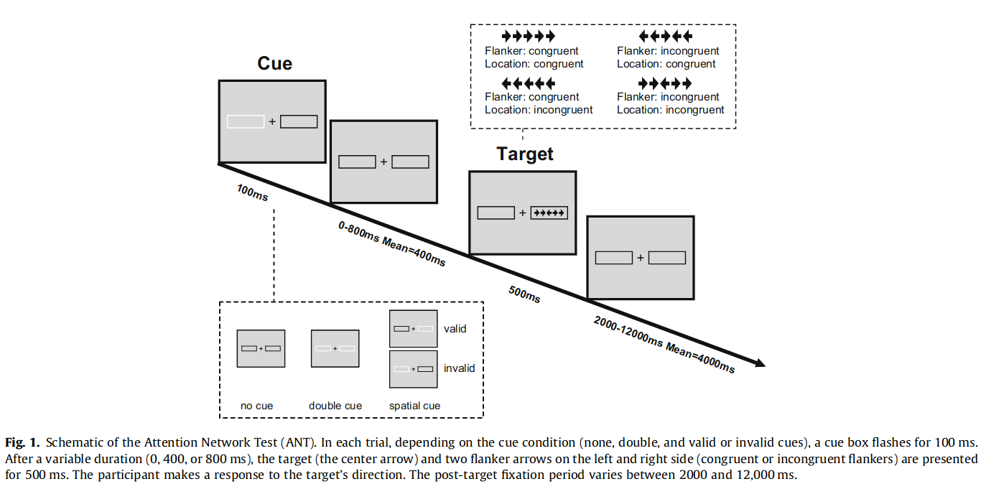

ANT-R task
=============

The `ant-r.py` is a python3 script implementing the ANT-R task described in Fan, J., Gu, X., Guise, K.G., Liu, X., Fossella, J., Wang, H., and Posner, M.I. (2009). Testing the behavioral interaction and integration of attentional networks. Brain and Cognition 70, 209–220. 10.1016/j.bandc.2009.02.002.

It relies on the python module [expyriment.org](expyriment.org) which must be installed prior to launching the experiment (see <https://docs.expyriment.org/Installation.html>). 

To run the experiment, simply execute the following command in a terminal ("Anancoda Prompt" if running under Windows with Anaconda Python installed): 

    python ant-r.py
	
The results are saved in the subfolder `data`, in files "ant-r_XX_aaaammddhhmm.xpd" where XX is the participant's number. 
	

Methods (from Fan et al., 2009)
------------------------------------

Stimuli consist of a row of five horizontal black arrows (one central target plus four flankers, two on each side), pointing leftward or rightward,against a gray background. A single arrow subtends 0.58° of visual angle and the contours of adjacent arrows are separated by 0.06° of visual angle, so that the target + flanker array subtends a total of 3.27° of visual angle. 

Participants’ task is to identify the direction of the center arrow by pressing a key with the index finger of the left hand for the left direction and a key with the index finger of the right hand for the right direction, while ignoring the spatial location (left or right) of the target relative to the fixation crosshair. Participants are instructed to make their response to the direction of the center target as quickly and accurately as possible. 

A cue, in the form of cue box flashing, may be shown before the target appears, which may or may not help the participants’ target detection depending on the cue conditions. There are three cue conditions in each run: 
* no-cue (no-cue box flashes before the target appears; 12 trials), 
* double-cue (both cue boxes flash before the target appears, so the cue is only temporally informative; 12 trials),
* spatial-cue (one cue box flashes before the target appears, so the cue is temporally and possibly spatially informative; 48 trials). 

RTs for the no- and double-cue conditions are used to assess the alerting benefit. 

To introduce the orienting component, a spatial cue and the subsequent stimulus are presented 4.69° left or right of a fixation crosshair continuously shown in the center of the screen. Participants have to shift attention from the fixation point to the target stimulus on each trial in order to determine the proper response. If attentional movements occur with a speed of about 8 ms/degree (Tsal, 1983), this visual angle should result in a cost of at least 37 ms. The validity of the spatial-cue is manipulated in order to measure the disengage and move operations (see (Posner et al., 1984). Specifically, 75% of the 48 spatial-cues (36 trials) are valid and 25% (12 trials) are invalid. The probability of valid cue is the sum of the individual conditions of no-cue, double-cue, and invalid cue. 
To introduce the conflict effect, the target (center arrow) is flanked on either side by two arrows of the same direction (congruent condition), or of the opposite direction (incongruent condition). To challenge the executive control function, double conflict that combines the flanker conflict effect (Eriksen & Eriksen, 1974) and the location conflict (Simon) effect (Simon & Berbaum, 1990) are
